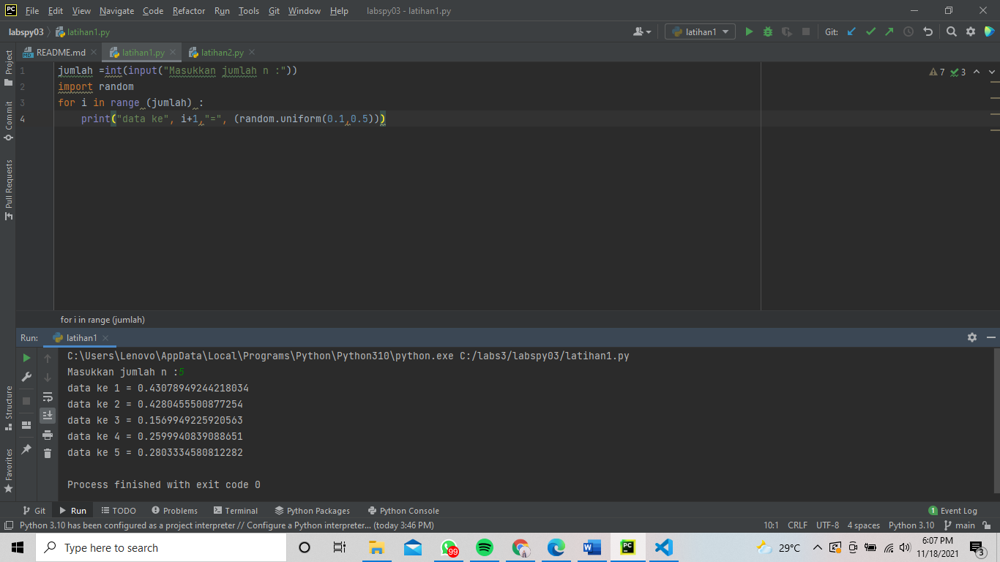
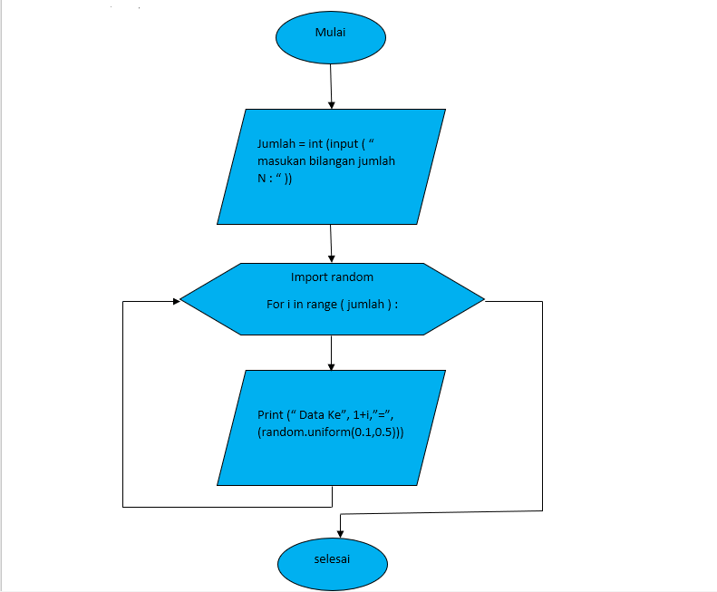
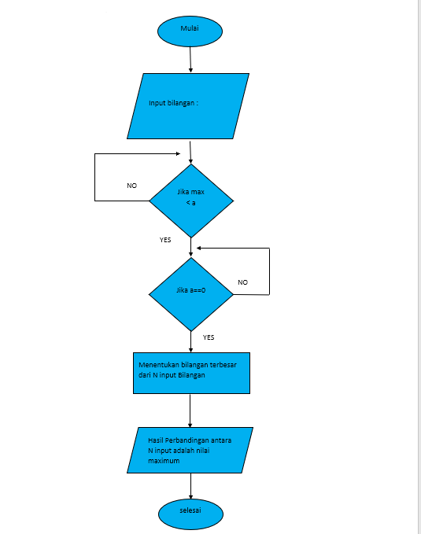

# labspy03
# Bahasa Pemrograman
# perulangan by Gede Krishna , 311910429

latihan 1

Urutan Pembuatan Program
1. Ketikan Program jumlah=int(input("Masukan Jumlah N : ")) 
2. Ketikan Program import random 
3. Ketikan Program for i in range ( jumlah ) : 
4. Ketikan Program print("Data ke", 1+i,"=>", (random.uniform(0.1,0.5))

Penjelasan Alur Program 
1. jumlah=int(input("Masukan Jumlah N : ")) Untuk menentukan jumlah input yang di inginkan sesuai tipe data yaitu interger tipe data bilangan bulat 
2. import random 
3. for i in range ( jumlah ) : Untuk Pengulangan dengan range jumlah 
4. print("Data ke", 1+i,"=>", (random.uniform(0.1,0.5))) Untuk menampilkan atau mencetak urutan data sesuai jumlah inputan dengan hasil di bawah 0.5
Berikut merupakan pprogramnya

Berikut merupakan flowchartnya

latihan 2

Urutan Pembuatan Program
1. Ketikan Program max= 0 
2. Ketikan Program while true: 
3. Ketikan Program a=int(input("Masukan Bilangan :")) 
4. Ketikan Program if max < a 
5. Ketikan Program max=a 
6. Ketikan Program if a==0: 
7. Ketikan Program break 
8. Ketikan Program print("Bilangan Tebesar Adalah :", max)

Penjelasan Alur Program
1. max= 0 kode max disini untuk menentukan nilai max nya adalah 0 
2. while true: Untuk perulangan hingga waktu yang tidak di tentukan atau selamanya 
3. a=int(input("Masukan Bilangan :")) a untuk menginput tipe data interger ( bilangan bulat ) 
4. if max < a max=a jika max kurang dari a maka max = a 
5. if a==0: break jika a= 0 maka akan berhenti dengan syarat break yang terpenuhi 
6. print("Bilangan Tebesar Adalah :", max) Menampilkan *Bilangan Tebesar Adalah : Nilai maximumnya
berikut merupakan programnya

Berikut merupakan flowchartnya

